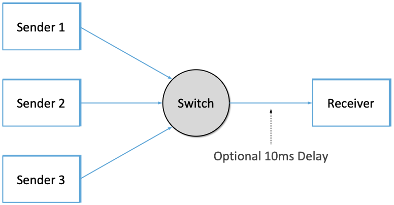

# 3.2 评判标准 未校正

在确定了设计拥塞控制机制所需的实现选择之后，接下来的问题是如何判断给定的解决方案是否有效。回想一下，在第一章中我们提出了一个问题：网络如何有效且公平的分配它的资源。这表明可以用至少两种广泛的措施来评估资源分配方案。我们依次考虑每个措施。

## 3.2.1 有效性

在评估拥塞控制机制的有效性时，一个好的起点是考虑网络的两个主要指标：吞吐量和延迟。显然，我们希望吞吐量尽可能高，延迟尽可能低。不幸的是，这些目标可能彼此矛盾。一种增加吞吐量的方法是尽可能让更多的数据包进入网络，以此来驱动所有链路的利用率达到100%。我们这样做是为了避免链路空闲，因为空闲的链路会降低吞吐量。但这种策略的问题在于，增加网络中的数据包数量也会增加每个路由器处的队列长度。这样的持续队列累积意味着数据包在网络中被耽误了，更坏的情况下数据包会被丢弃。在网络中间丢包不仅会影响延迟，还会降低吞吐量，因为数据包未能成功送到目的地而导致上游链路带宽被浪费了。

> 我们有时使用goodput，而不是吞吐量（throughput）来强调我们关心的是成功通过网络送到接收端的数据，而不仅仅是发送端发出的数据。

系统吞吐量与延迟的比例是评估资源分配方案效果的一个通用指标。这个比例有时被称为系统的_功率（Power）：_

$$Power = Throughput / Delay$$

直观地说，这里比例是你给网络系统施加的负载的函数，而我们的目标就是最大化这个比例。施加的负载由资源分配机制（即拥塞控制机制）决定。图11展示了一个有代表性的功率曲线，理想情况下，资源分配机制会保持在这个曲线的顶点。在峰值左侧，机制过于保守；也就是说，它没有允许发送足够多的数据包来保持链路繁忙。在峰值右侧，则是允许进入网络的数据包太多，以至于(a)由于队列导致的延迟增加（分母）远大于任何小的吞吐量的增加，或者(b)吞吐量（分子）由于数据包被丢弃而开始下降。

<figure><figcaption>
图11： 吞吐量和延d额比例是负载的函数
</figcaption></figure>

此外，我们还需要关注系统在高负荷运行时的情况——即图11中曲线的右端。理想情况下，我们希望避免系统吞吐量接近零的情况。我们的目标是使机制保持稳定---即使当前负载很高，数据包还是能通过网络传递。如果一种机制不能在高负载下稳定运行，那么网络将会遭受拥塞崩溃。

值得注意的是，尽管“持久队列累积”和“拥塞崩溃”都需要避免，但没有确切定义来界定网络何时受到这两者的影响。它们都是对算法行为的主观判断，最终，延迟和吞吐量还是唯二重要的性能指标。

## 3.2.2 公平性

有效的网络资源利用率并不是判定资源分配方案的唯一标准。我们还必须考虑公平性问题。然而，当我们尝试定义何为公平的资源分配时，我们很快就会进入模糊不清的领域。例如，基于预留的资源分配方案提供了一种明确的受控的不公平分配方案。通过这样的方案，我们可以使用通过预留来使视频流在某个链接上获得1 Mbps的速率，而文件传输在同一链接上仅获得10 kbps的速率。

在没有明确的反对信息时，当多个流共享一个特定链路时，我们希望每个流都能获得等额的带宽分配。这个定义假设“公平”的带宽分配意味着相同的带宽分配。但是，即使没有资源预留，相同的带宽分配也不一定等同于公平的带宽分配。我们是否也应该考虑正在比较的数据流的路径长度？例如，如图12所示，当一个四跳流与三个一跳流竞争时，什么是公平的？

<figure><figcaption>
图12：1个4跳流和3个1跳流之间的竞争
</figcaption></figure>

假设最公平的情况是所有数据流获得相同的带宽，网络研究员Raj Jain提出了一个可以用来量化拥塞控制机制公平性的指标。Jain的公平性指数定义如下。假设一组流量吞吐量$$（x_1, x_2, ..., x_n）$$。它们有相同的单位，例如bps。下面的函数给出了数据流的公平性指标：

<figure><figcaption></figcaption></figure>

公平性指标是一个介于0和1之间的数字，其中1代表最高的公平性。为了理解这个指标背后的含义，假设n个数据流都被分配到了相同的吞吐量，那么公平性指标等于：

<figure><figcaption></figcaption></figure>

现在假设一个数据流被分配到了1 + Δ的吞吐量，那么公平性指标变成了：

<figure><figcaption></figcaption></figure>

这里，分母比分子多了 $$(n−1)Δ^2$$. 因此，无论这个数据流比所有其他数据流获得更多还是更少（正或负的Δ）吞吐量，公平性指数现在已经降到了 1 以下。另一个简单的情况是，n个数据流中只有k个数据流获得了公平的吞吐量，剩下的n-k个数据流没有分配到吞吐量，此时的公平性指数下降到 k/n。

_更多阅读：R. Jain, D. Chiu, and W. Hawe._ [_A Quantitative Measure of Fairness and Discrimination for Resource Allocation in Shared Computer Systems_](https://www.cse.wustl.edu/\~jain/papers/ftp/fairness.pdf)_. DEC Research Report TR-301, 1984._

下一节我们将从新审视公平性的概念，因为在部署新的拥塞控制算法时需要考虑它。如上所述，公平性的问题它看起来那么明显。

TCP-friendly rate control (TFRC) 也使用了公平性概念。TFRC 使用TCP吞吐量公式（在1.3节中讨论过）来估算一个执行了 TCP 拥塞控制算法的数据流在拥塞链路上所能获得的带宽份额，并将其设定为应用发数据的目标速率。然后，应用可以做出决策来帮助它达到那个目标速率。例如，一个视频流应用可能会在不同的编码质量级别中选择，以试图维持平均速率在 TFRC 所确定的“公平”水平。
